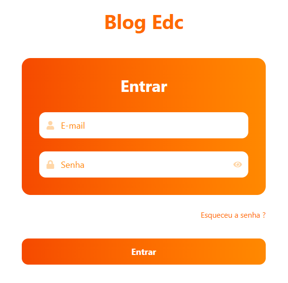
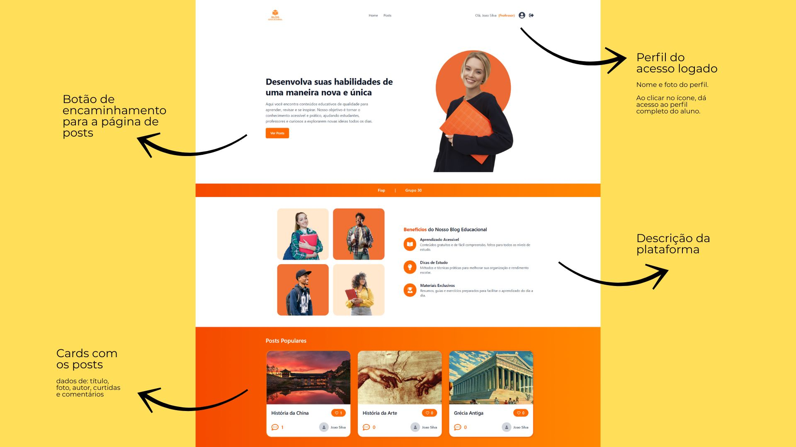
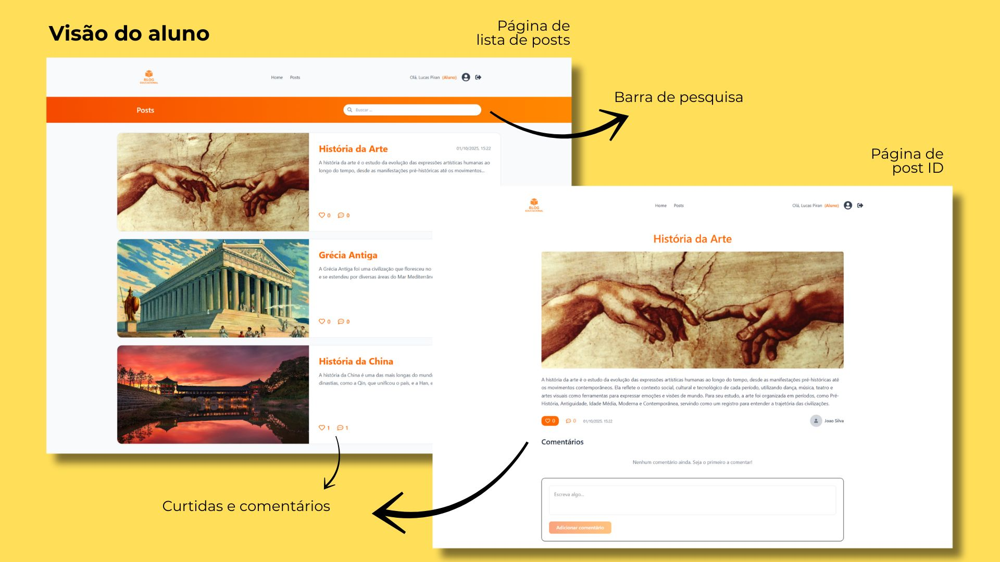
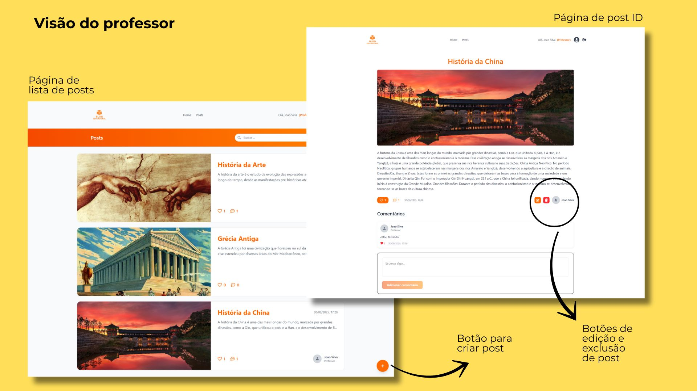
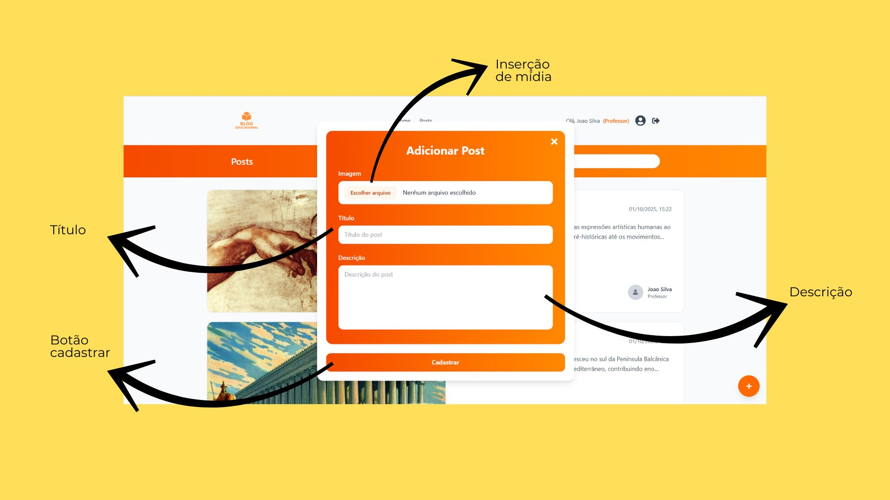
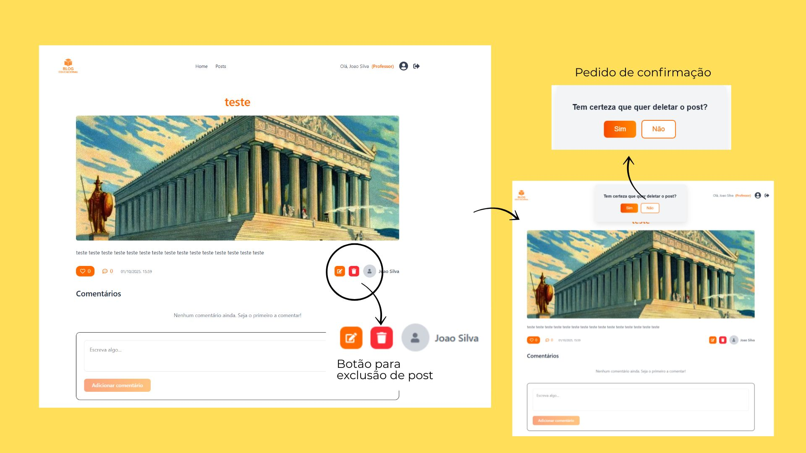
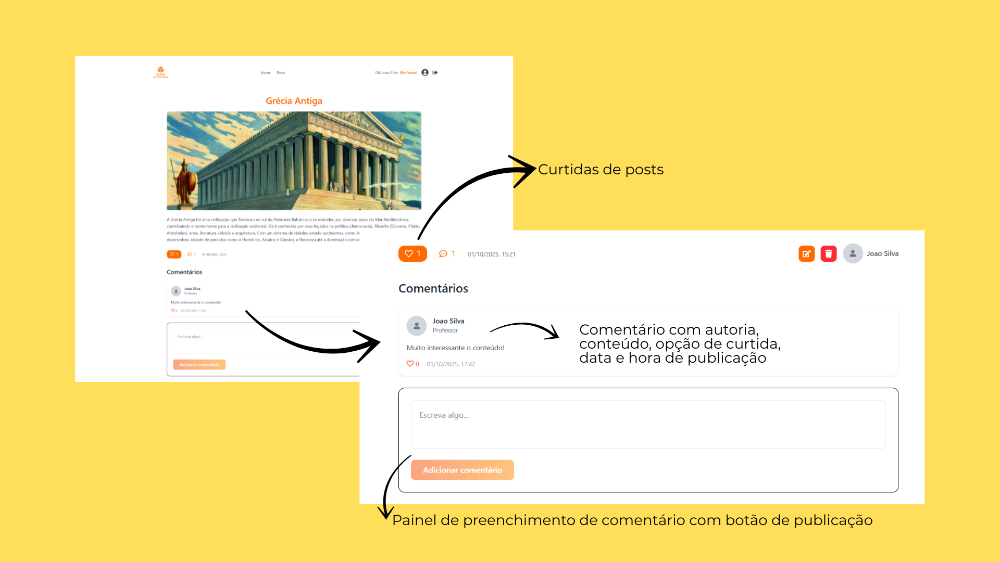

# Blog Education API / FrontEnd

## Introdução

Desenvolvido em React com TypeScript, este projeto cumpre os requisitos do TechChallenge/Fase 03, da pós-graduação em Full Stack Development, da FIAP, fornecendo uma interface gráfica moderna, responsiva e intuitiva para interação com a API de blog educacional.

A aplicação foi projetada para oferecer uma experiência de usuário fluida e agradável, separando as funcionalidades disponíveis para alunos e professores, com um sistema de autenticação para proteger as rotas administrativas.

### Objetivo

Facilitar a comunicação entre professores e alunos da rede pública por meio de uma plataforma de blogging educacional que permita a publicação e o acesso a conteúdos escolares, como textos e atividades.

### Público-alvo

Pessoas da rede pública de educação, mais especificamente dois agentes:

- **Professores**: responsáveis pela criação, atualização, edição e exclusão de postagens.
- **Alunos**: usuários que podem visualizar e ler as postagens.

### Equipe

| Nome | E-mail |
| --- | --- |
| Lucas Piran | [lucas13piran@gmail.com](mailto:lucas13piran@gmail.com) |
| Felipe Ragne Silveira | [frsilveira01@outlook.com](mailto:frsilveira01@outlook.com) |
| Lais Taine de Oliveira | [lais.taine@gmail.com](mailto:lais.taine@gmail.com) |
| Pedro Juliano Quimelo | [pedrojulianoquimelo@outlook.com](mailto:pedrojulianoquimelo@outlook.com) |


## 2. Funcionalidades Implementadas 

A interface implementa todas as funcionalidades essenciais exigidas para a plataforma de blog:

* **Página Principal:** Apresentação da plataforma e lista de posts em layout de cards.
* **Página de Lista de Posts:** Exibe a lista de posts com um campo de busca que filtra os resultados dinamicamente.
* **Página de Leitura de Post:** Apresenta o conteúdo completo de um post, incluindo informações do autor e interações como curtidas e comentários.
* **Criação e Edição de Posts:** Páginas exclusivas para professores, permitindo a criação de novas postagens e a edição de posts existentes através de um formulário modal.
* **Painel Administrativo:** Os professores possuem acesso a funcionalidades administrativas, como editar e excluir qualquer post.
* **Autenticação e Autorização:** Sistema completo de registro e login. O acesso às páginas de criação e edição é restrito a usuários autenticados com o perfil de "professor".
* **Notificações:** Fornece feedback visual ao usuário sobre o resultado de suas ações (ex: post criado com sucesso).

## 3. Tecnologias Utilizadas 

O projeto foi desenvolvido com um conjunto de ferramentas para garantir performance, escalabilidade e boa experiência de desenvolvimento:

* **Framework Principal:** React 19 com TypeScript
* **Build Tool:** Vite.
* **Estilização:** Tailwind CSS.
* **Roteamento:** React Router DOM v7.
* **Requisições HTTP:** Axios.
* **Animações:** Framer Motion.
* **Ícones:** React Icons.
* **Notificações:** React Toastify.
* **Linting:** ESLint para garantir a qualidade e padronização do código.

## 4. Arquitetura da Aplicação 

A estrutura do projeto foi organizada de forma modular e escalável, separando as responsabilidades em diretórios específicos:

* `/src/assets`: Armazena imagens e outros arquivos estáticos.
* `/src/components`: Contém componentes React reutilizáveis (ex: PostCard.tsx, Header.tsx, AddPostModal.tsx).
* `/src/contexts`: Gerencia o estado global da aplicação, como o AuthContext.tsx, que provê informações de autenticação para toda a árvore de componentes.
* `/src/hooks`: Armazena hooks customizados para lógicas reutilizáveis.
* `/src/layouts`: Componentes responsáveis pela estrutura geral das páginas (ex: MainLayout).
* `/src/pages`: Componentes que representam as páginas completas da aplicação (ex: Home.tsx, Posts.tsx).
* `/src/routes`: Centraliza a configuração das rotas da aplicação utilizando o React Router.
* `/src/services`: Contém a lógica de comunicação com a API backend, utilizando o Axios para fazer as chamadas HTTP (api.ts).
* `/src/styles`: Arquivos de estilização global, como o app.css.
* `/src/types`: Definições de tipos TypeScript para garantir a consistência dos dados em toda a aplicação.

### Fluxo de Dados e Autenticação

1.  **Estado de Autenticação:** O AuthContext é o responsável por gerenciar o estado do usuário e o token JWT.
2.  **Login:** Ao fazer login, o token e os dados do usuário são salvos no localStorage e no estado do contexto, garantindo que o usuário permaneça logado.
3.  **Requisições Autenticadas:** Um interceptor do Axios anexa automaticamente o token JWT a todas as requisições para endpoints protegidos.
4.  **Tratamento de Token Expirado:** Um interceptor de resposta do Axios verifica se a API retorna um erro 401 Unauthorized. Caso isso ocorra, ele limpa o localStorage e redireciona o usuário para a página de login, garantindo uma experiência segura.

### Visão Geral

A arquitetura da aplicação foi projetada seguindo um modelo de três camadas, separando as responsabilidades entre a interface do usuário (FrontEnd), a lógica de negócio (BackEnd) e o armazenamento de dados (Banco de Dados).

**FrontEnd (Client-Side):** Desenvolvido com React e TypeScript, é responsável por toda a interface gráfica e experiência do usuário. Ele roda diretamente no navegador do cliente.

**BackEnd (Server-Side):** É uma API RESTful construída em Node.js com o framework Express.js. Suas responsabilidades incluem gerenciar as regras de negócio, processar as requisições, validar dados, autenticar usuários e se comunicar com o banco de dados.

**Banco de Dados (Database):** Utilizamos o MongoDB, um banco de dados NoSQL, para persistir os dados da aplicação, como usuários, postagens e comentários. A interação com o banco é gerenciada pelo Mongoose.

A comunicação entre as camadas ocorre através de requisições HTTP. O FrontEnd utiliza a biblioteca Axios para fazer chamadas aos endpoints RESTful expostos pelo BackEnd, que por sua vez responde com dados no formato JSON.


## 5. Setup e Execução do Projeto 

Siga os passos abaixo para executar o frontend localmente.

#### Pré-requisitos
* Node.js (versão 18 ou superior)
* NPM ou Yarn
* BackEnd da aplicação rodando localmente ou em um ambiente de desenvolvimento (https://backend-blog-education.onrender.com).

#### Passos para Execução

1.  **Clone o repositório:**
    ```bash
    git clone https://github.com/techchallenge-fiap-2025/blog-education-frontend/
    ```

2.  **Navegue até a pasta do frontEnd:**
    ```bash
    cd blog-education-frontend-main
    ```

3.  **Instale as dependências:**
    ```bash
    npm install
    ```

4.  **Configurar a URL da API:**
    
    Crie um arquivo `.env` na raiz do projeto.
    Adicione a variável de ambiente para a URL do backend:
    ```bash 
    REACT_APP_API_URL=https://backend-blog-education.onrender.com/
    ```

5.  **Inicie o servidor de desenvolvimento:**
    ```bash
    npm run dev
    ```

6.  **A aplicação estará disponível em `http://localhost:5173`**


## 6. Guia de Uso

Breve guia sobre como interagir com a aplicação:

### Página de abertura/Login (Autenticação e autorização)


Você pode acessar a plataforma a partir de dois usuários:

| Perfil | Descrição das Permissões | E-mail de Teste | Senha de Teste |
| :--- | :--- | :--- | :--- |
| 🧑‍🎓 **Estudante** | Navega pela lista de posts, utiliza a busca e visualiza o conteúdo completo. | `lucas13piran@gmail.com` | `Lucas@2025` |
| 🧑‍🏫 **Docente** | Acessa a página administrativa para criar, ver, editar e excluir qualquer post. | `joaosilvateste@gmail.com` | `Prof12345` |

### Homepage
Ao logar com qualquer um dos usuários, você será encaminhado para a HomePage, onde terá um menu com dois links centralizados (Home e Posts) e descrição de login à direita.

A página ainda conta com apresentação da plataforma e cards de posts populares ao pé do layout.



### Páginas com Lista de Posts e Leitura de Post
Ao clicar no link "Posts", no menu, ou botão "ver posts", você será encaminhado para a página com a lista de todos os conteúdos publicados. Com um click no card, no final da página, você será direcionado para o post de leitura selecionado.



Há um botão laranja com o símbolo "+" para criação de posts. Este botão só é visível no perfil de professor.

### Páginas de criação e edição de Posts
Ao clicar no botão de criação de posts, o professor deve preencher os campos com imagem, título e descrição do conteúdo que pretende publicar. Ao clicar em cadastrar, o post é publicado com autoria e data automáticas.


### Botão de exclusão de Posts
Botões de edição e exclusão só estão disponíveis para professores. Ao clicar em excluir, o professor é alertado e deve confirmar se deseja continuar o procedimento.


### Extras (comentários e curtidas)
Campo de comentários e curtidas para interação entre professores e alunos.


## 7. Relato de Experiências e Desafios Enfrentados

### Metodologia de Trabalho 
Para fins de aprendizado, todo integrante da equipe se propôs a produzir sua própria interface individual para então decidir por aquela mais apropriada, seguindo os critérios de avaliação. Após a apresentação individual, um projeto é escolhido e aprimorado em conjunto, com divisões de tarefas por aptidão.

### Desafios Técnicos
O desafio técnico mais significativo que nossa equipe enfrentou foi a integração entre a aplicação React (frontEnd) e a API Node.js (backEnd). Isso exigiu depuração e uma comunicação mais precisa para padronizar os "contratos" de dados entre as duas pontas da aplicação.

Trabalhar individualmente em um projeto conjunto também é um desafio da metodologia adotada, considerando as alterações que cada integrante faz para criar sua própria proposta. Este formato de trabalho exigiu que somássemos esforços ao projeto final, exigindo revisão e leitura mais apurada para interpretação e possíveis correçõs no caminho. De modo geral, soubemos lidar bem com isso.

### Melhorias

É válido ressaltar que a API não está finalizada e pode ser aprimorada com algumas melhorias para se tornar mais robusta, como:

**Página de registro de usuário**: Uma página administrativa com acesso restrito para que seja feito o cadastro, edição e exclusão de usuários.

**Testes de segurança**: aumentar a cobertura de testes para tornar o projeto mais seguro.


## Considerações Finais

O projeto possibilitou aplicar os conceitos aprendidos na Fase 3 - FrontEnd, da pós Tech Full Stack Development, da FIAP, unindo teoria e prática. 

O processo colaborativo e o uso de ferramentas de apoio foram fundamentais para superar desafios técnicos e entregar uma solução funcional e com propósito social.


# Contatos


[lucas13piran@gmail.com](mailto:lucas13piran@gmail.com)


[frsilveira01@outlook.com](mailto:frsilveira01@outlook.com)


[lais.taine@gmail.com](mailto:lais.taine@gmail.com)


[pedrojulianoquimelo@outlook.com](mailto:pedrojulianoquimelo@outlook.com)


